# Librara Client

Librara is a modern library management web application built with React, TypeScript and Tailwind CSS.

This frontend consumes the Librara REST API and provides a complete interface for authentication, book management, loan tracking, user management, dashboard analytics and account security.

## Screenshots

### Login

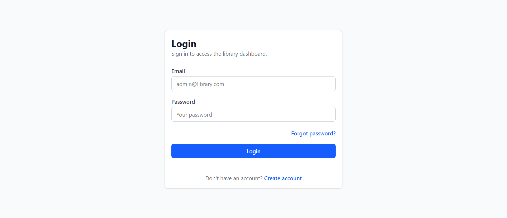

### Register

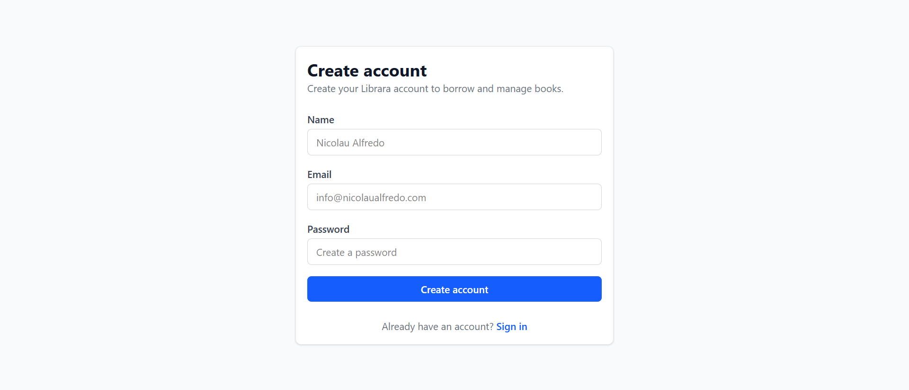

### Dashboard

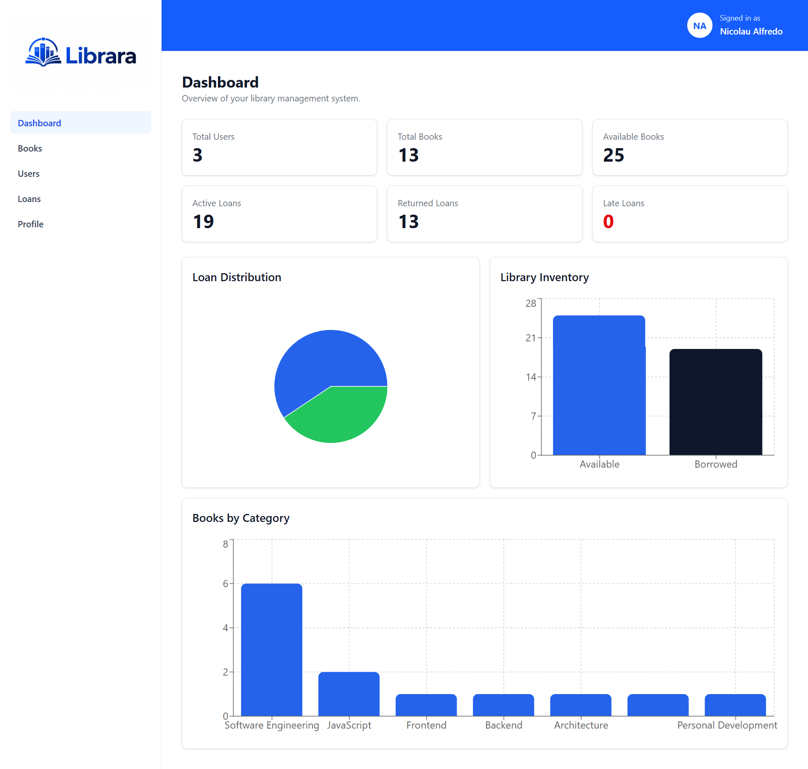

### Books

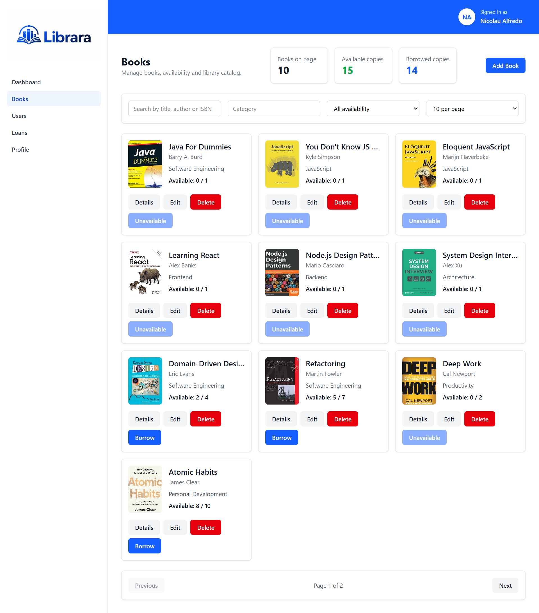

### Book Details

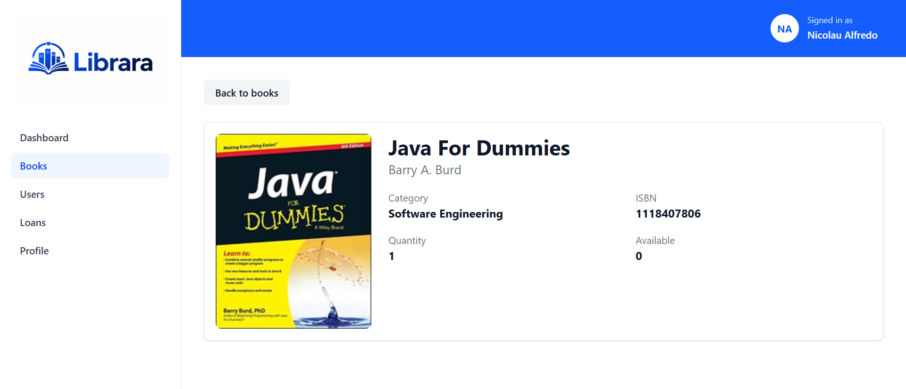

### Users

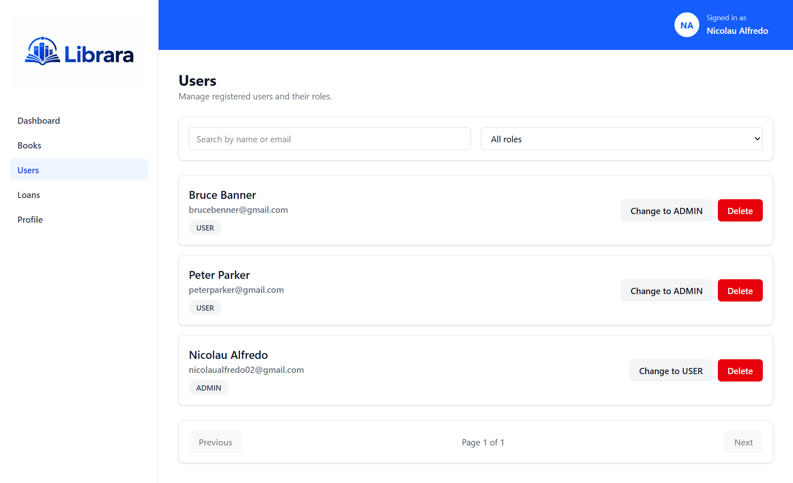

### Loans

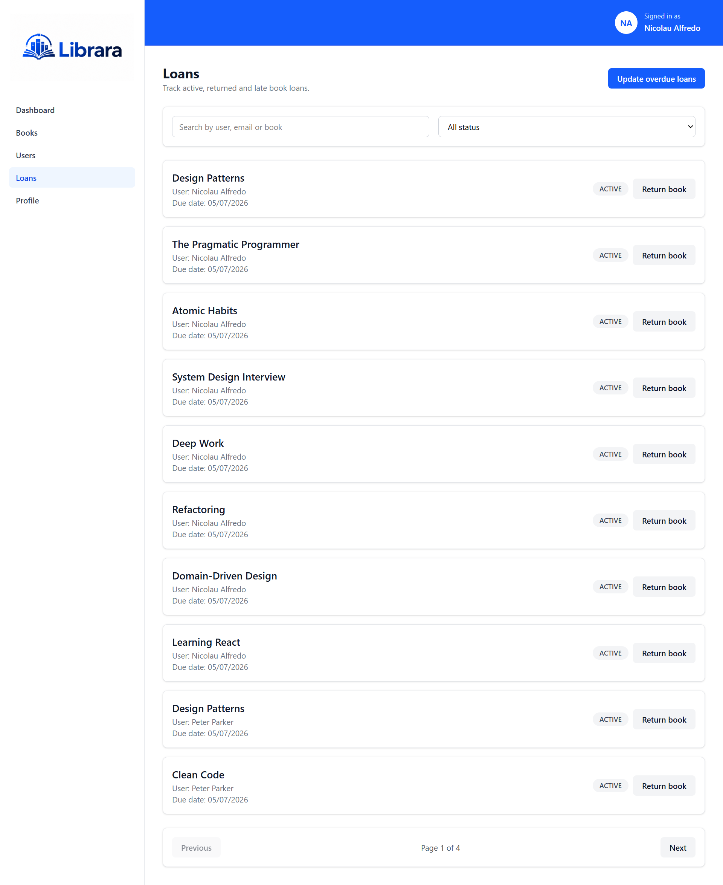

### My Loans

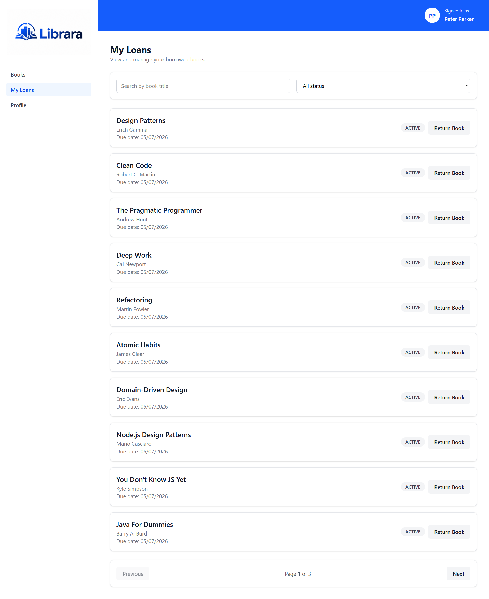

### Profile

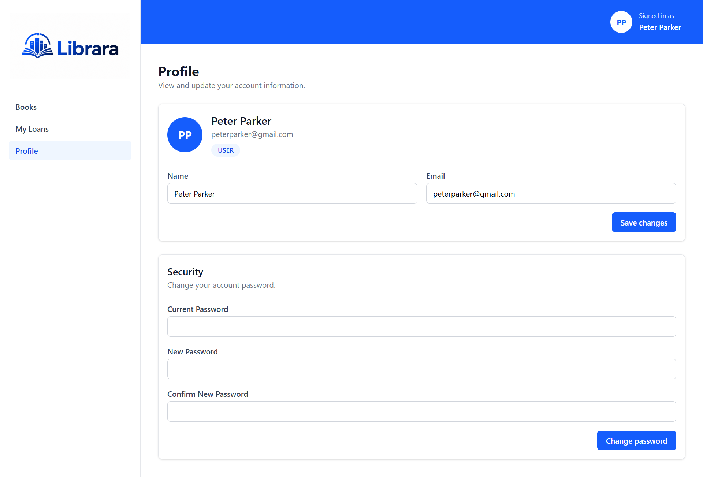

### Forgot Password

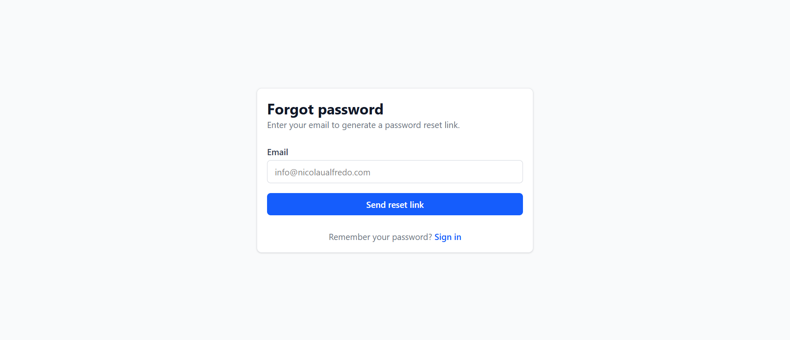

### Reset Password

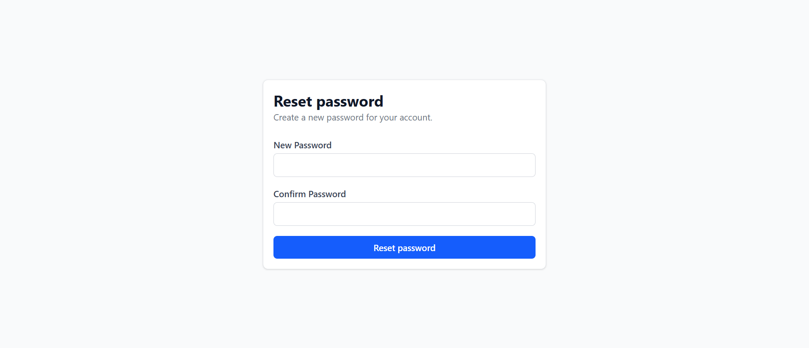

## Features

### Authentication

- User login
- User registration
- Protected routes
- Role-based UI
- Forgot password
- Reset password
- Change password
- Profile update
- Persistent authentication with local storage

### Admin Features

- Admin dashboard
- User management
- Book management
- Loan management
- Dashboard analytics
- Update overdue loans
- Delete users
- Change user roles
- Create, update and delete books

### User Features

- View available books
- Borrow books
- View personal loans
- Return borrowed books
- Search personal loans
- Filter loans by status
- Update profile information
- Change password

### Books

- List books
- Search books
- Filter books by category
- Filter available books
- Pagination
- Create book
- Update book
- Delete book
- View book details
- Borrow book

### Loans

- Admin loan overview
- User personal loans
- Return books
- Filter by status
- Search by user, email or book
- Automatic overdue status integration

### UI / UX

- Responsive dashboard layout
- Mobile sidebar navigation
- Avatar dropdown
- Toast notifications
- Confirmation modals
- Empty states
- Branded Librara interface
- Dashboard charts

## Tech Stack

- React
- TypeScript
- Vite
- Tailwind CSS
- React Router
- TanStack Query
- React Hook Form
- Zod
- Axios
- Recharts
- React Hot Toast
- Lucide React

## Project Structure

```txt
src
├── api
├── components
│   ├── layout
│   ├── protected-route
│   └── ui
├── contexts
├── hooks
├── pages
│   ├── books
│   ├── dashboard
│   ├── forgot-password
│   ├── loans
│   ├── login
│   ├── my-loans
│   ├── profile
│   ├── register
│   ├── reset-password
│   └── users
├── routes
├── styles
├── types
└── utils
````

## Environment Variables

Create a `.env` file in the root of the project:

```env
VITE_API_URL=http://localhost:8000
```

Also keep a `.env.example` file:

```env
VITE_API_URL=http://localhost:8000
```

## Installation

Clone the repository:

```bash
git clone https://github.com/NicolauAlfredo/library-management-client.git
```

Enter the project folder:

```bash
cd library-management-client
```

Install dependencies:

```bash
npm install
```

Start development server:

```bash
npm run dev
```

Build for production:

```bash
npm run build
```

Preview production build:

```bash
npm run preview
```

## Backend API

This frontend requires the [library-management-api](https://github.com/NicolauAlfredo/library-management-api.git) backend API running locally.

Default API URL:

```txt
http://localhost:8000
```

Main backend features:

* JWT authentication
* Role-based authorization
* Books API
* Users API
* Loans API
* Dashboard API
* Password recovery with email
* MySQL database
* Docker support

## Roles

### Admin

Admins can access:

```txt
/dashboard
/books
/users
/loans
/profile
```

Admins can manage books, users, loans and dashboard analytics.

### User

Users can access:

```txt
/books
/my-loans
/profile
```

Users can borrow books, return books, manage their own profile and recover their password.

## Main Routes

```txt
/login
/register
/forgot-password
/reset-password
/dashboard
/books
/books/:id
/users
/loans
/my-loans
/profile
```

## Build Status

The project builds successfully with:

```bash
npm run build
```

## Future Improvements

* Lazy loading for route-level code splitting
* More advanced dashboard analytics
* Better accessibility improvements
* Unit tests
* Integration tests
* Deployment on Vercel
* Backend deployment on Railway or Render

## License

This project was developed for educational and portfolio purposes.
